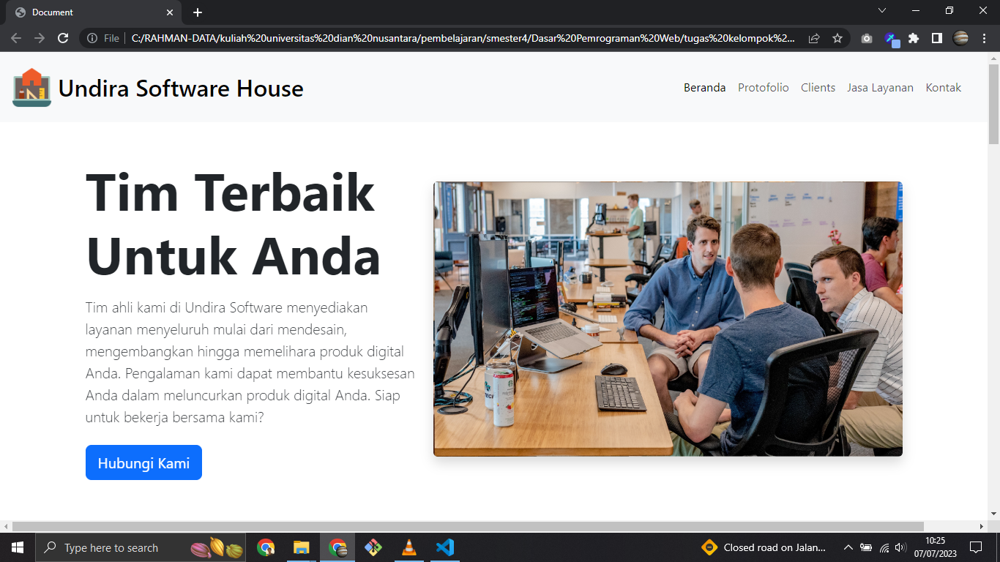

# kel-1_tanjungDuren_web-company

  
  
  
  

  

tugas kuliah pemrograman web landing page company profile undira software house, tipe website static tanpa database pure font-end yang terlihat menarik dan mamapu menarik simpati pengguna menjadi pelanggan. dengan pembagian tugas pada project ini diharapkan dapat mencapai hasil yang maksimal pada desain website.

<h5>kelompok 1 - tanjung duren</h5>
<h6><b>Pembagian Tugas 👨‍💻 🛠</b></h6>
<ul>
  <li>Rahman Islam - koding frame sturcture license, readme, penambahan plugin font-end serta base landing page web</li>
  <li>Isati Gulo - nulis hero section</li>
  <li>Rizkiy Febrian - section klien dan jasa</li>
  <li>Arman Juliansyah - section membantu rapikan desain dan bagian tulisan pada heading dan sub heading</li>
  <li>Dannie Basse - setion protofolio dan footer</li>
</ul>
